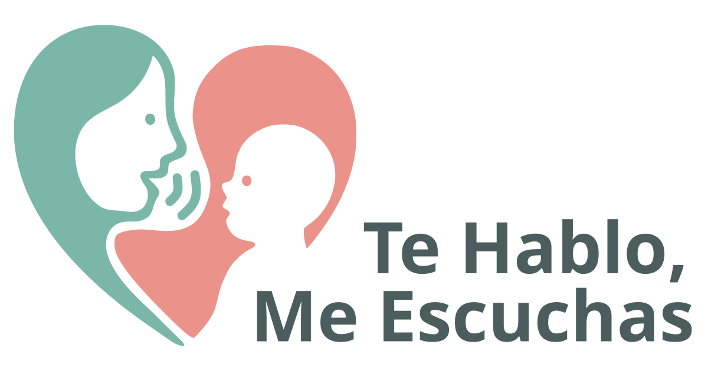
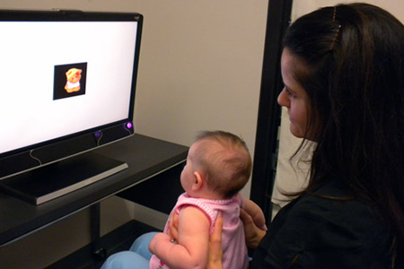

<div style="text-align: center;">
  

  <p style="font-size: 50%;">
    [Juan David Leongómez, Milena Vásquez-Amézquita, Nicolás Ignacio Ramos Rodríguez,
    María Catalina Bages Mesa,]{style="color:#7ab7a9;"} [Daniel Toro Avila, Adriana María Cristancho Arévalo,]{style="color:#eb938a;"} [Ruth Stella Chacon Pinilla, Lina Maria Rodríguez Granada, Luz Helena Buitrago León,]{style="color:#7ab7a9;"} [Natalia Moreno-Buitrago, David A. Puts]{style="color:#eb938a;"}
  </p>

  <p style="font-size: 70%;">
    Convocatoria Interna - Investigación Avanzada · 2025
  </p>

</div>


------------------------------------------------------------------------

## Habla dirigida a bebés ([IDS]{style="color:#eb938a;"})

<iframe width="100%" height="480" src="https://www.youtube.com/embed/O8ETEajtfUs?start=11" title="YouTube video player" frameborder="0" allow="accelerometer; autoplay; clipboard-write; encrypted-media; gyroscope; picture-in-picture" allowfullscreen>

</iframe>

------------------------------------------------------------------------

## ¿Qué nos dice una voz? {auto-animate="true"}

-   Antes de hablar, de caminar o entender palabras, las y los bebés ya **escuchan**.

::: {.fragment .fade-in}
-   Nacemos preparados para **conectarnos** con quienes nos cuidan.
:::

::: {.fragment .fade-in}
-   Esa conexión ocurre, en gran parte, a través de una voz especial: el habla dirigida a bebés ([IDS]{style="color:#eb938a;"}).
:::

------------------------------------------------------------------------

## ¿Qué nos dice una voz? {auto-animate="true" background-image="img/bebe1.png" background-size="cover" background-position="center" background-opacity="0.5"}

> El [IDS]{style="color:#eb938a;"} no solo es "ternura". Es una herramienta poderosa de comunicación emocional, social y cognitiva.<br><br> Es necesaria para el desarrollo de las y los bebés y su supervivencia.

------------------------------------------------------------------------

## ¿Por qué importa el [IDS]{style="color:#eb938a;"}? {auto-animate="true"}

-   [SUPERVIVENCIA:]{style="color:#7ab7a9;"} Mejora el apego y la regulación emocional.

::: {.fragment .fade-in}
-   [DESARROLLO:]{style="color:#eb938a;"} Capta la atención del bebé y facilita el aprendizaje del lenguaje.
:::

::: {.fragment .fade-in}
-   [NECESARIO:]{style="color:#7ab7a9;"} Parece ser **universal**, está presente en todas las culturas y tiene características consistentes.
:::

::: {.fragment .fade-in}
-   [EVOLUCIÓN:]{style="color:#eb938a;"} Tiene propiedades similares al canto, y puede estar en la raíz evolutiva de la música y el lenguaje.
:::

------------------------------------------------------------------------

## ¿Por qué importa el [IDS]{style="color:#eb938a;"}? {auto-animate="true"}

> El [IDS]{style="color:#eb938a;"} puede estar en la base de la evolución de la musicalidad y el lenguaje. En humanos, el **cuidado aloparental** implica que las señales de musicalidad de otros cuidadores potenciales pueden indicar confianza y capacidad para cuidar y vincularse con el bebé.

[[Leongómez et al, 2022](https://doi.org/10.1098/rstb.2020.0391)]{style="font-size: 50%;"}

------------------------------------------------------------------------

## Este proyecto {auto-animate="true"}

**2 estudios**

::: {.fragment}
-  **Estudio 1:** Efectos de la manipulación acústica del [IDS]{style="color:#eb938a;"} en la atención de bebés en etapa prelingüística
:::
::: {.fragment .fade-in}
-  **Estudio 2:** Efectos del [IDS]{style="color:#eb938a;"} en habilidades lingüísticas y musicales posteriores
:::

------------------------------------------------------------------------

## Diseño estudio 1 {auto-animate="true"}

-  **Estudio 1:** Efectos de la manipulación acústica del [IDS]{style="color:#eb938a;"} en la atención de bebés en etapa prelingüística

:::: {.columns}

::: {.column width="50%"}
{width="72%" style="text-align: center;"}
:::

::: {.column width="40%" style="font-size: 65%;"}
::: {.fragment}
-   [200 bebés]{style="color:#7ab7a9;"} de 3–9 meses.
:::
::: {.fragment .fade-in}
-   Evaluación [en laboratorio]{style="color:#7ab7a9;"} con *eye-tracking*, y herramientas de inteligencia artificial (emociones y ritmo cardíaco), todo con tecnología accesible y de código abierto.
:::
:::

::::

------------------------------------------------------------------------

## Diseño estudio 2 {auto-animate="true"}

-  **Estudio 2:** Efectos del [IDS]{style="color:#eb938a;"} en habilidades lingüísticas y musicales posteriores

:::: {.columns}

::: {.column width="50%"}
{width="55%" style="text-align: center;"}
:::

::: {.column width="40%" style="font-size: 65%;"}
::: {.fragment}
-   [480 madres]{style="color:#7ab7a9;"} de bebés de 16–23 meses.
:::
::: {.fragment .fade-in}
-   Evaluación [en línea]{style="color:#7ab7a9;"}: videos del IDS materno durante el primer año + cuestionarios sobre desarrollo lingüístico y musical.
:::
:::

::::

------------------------------------------------------------------------

## Ética {auto-animate="true"}

- **El proyecto** ya cuenta con aprobación ética (CIE 2025-110).

::: {.fragment .fade-in}
- **Estudio 2** es, además, sin riesgo.
:::

------------------------------------------------------------------------

## Equipo {auto-animate="true"}

```{r}
#| echo: false
#| message: false
#| warning: false

library(gt)
library(dplyr)
library(stringr)

# ---- Datos ----
df <- tribble(
  ~Nombre,                         ~Grupo,                                ~AfType,            ~Experticia,
  "Juan David Leongómez",          "CODEC",                               "UEB",              "Análisis de comportamiento",
  "Milena Vásquez-Amézquita",      "CODEC",                               "UEB",              "Neurociencia",
  "Nicolás Ignacio Ramos Rodríguez","Investigaciones Pediátricas Bosque",  "UEB",              "Pediatría",
  "María Catalina Bages Mesa",     "Investigaciones Pediátricas Bosque",  "UEB",              "Pediatría",
  "Daniel Toro Avila",             "Independiente",                       "Independiente",    "Pediatría",
  "Adriana Cristancho Arévalo",    "Investigaciones Pediátricas Bosque",  "UEB",              "Pediatría",
  "Ruth Stella Chacon Pinilla",    "Educación e Investigación UNBOSQUE",  "UEB",              "Educación",
  "Lina Maria Rodríguez Granada",     "PSADEC-G",   "UEB",              "Psicología de la música",
  "Luz Helena Buitrago León",          "PSADEC-G",   "UEB",              "Psicología del desarrollo",
  "Natalia Moreno-Buitrago",       "Externo",                             "OSU",              "Desarrollo musical",
  "David A. Puts",                 "Externo",                             "PSU",              "Evolución comportamental"
) %>%
  mutate(
    # Ruta al logo según afiliación
    logo_path = case_when(
      AfType == "UEB" ~ "img/Logo_UEB.svg",
      AfType == "OSU" ~ "img/Logo_OSU.svg",
      AfType == "PSU" ~ "img/Logo_PSU.svg",
      TRUE            ~ NA_character_
    ),
    # Columna que se mostrará en la tabla (logo o texto "Independiente")
    Afiliacion = if_else(is.na(logo_path), "Independiente", "")
  )

# ---- Construcción de la tabla gt ----
tab <- df |>
  select(Nombre, Grupo, Afiliacion, Experticia) |>
  gt() |>
  # Reemplazar celdas de Afiliacion con la imagen cuando exista logo_path
  text_transform(
    locations = cells_body(columns = Afiliacion),
    fn = function(x) {
      # 'x' es el vector de celdas originales; usamos 'df$logo_path' para decidir
      mapply(function(cell, logo) {
        if (!is.na(logo)) {
          # Imagen local con altura fija para no inflar la fila
          html(glue::glue(""))
        } else {
          # Mantenemos el texto "Independiente"
          cell
        }
      }, x, df$logo_path, SIMPLIFY = FALSE)
    }
  ) |>
  # Etiquetas de columnas
  cols_label(
    Nombre     = "Nombre",
    Grupo      = "Grupo UEB",
    Afiliacion = "Afiliación",
    Experticia = "Experticia"
  ) |>
  # Alineación
  cols_align(columns = c(Grupo, Afiliacion, Experticia), align = "center") |>
  # Estilos de color de fondo por columna Afiliación (con alpha 0.3)
  tab_style(
    style = cell_fill(color = "rgba(255,165,0,0.3)"), # naranja UEB
    locations = cells_body(
      columns = Afiliacion,
      rows = df$AfType == "UEB"
    )
  ) |>
  tab_style(
    style = cell_fill(color = "rgba(220,53,69,0.3)"), # rojo OSU
    locations = cells_body(
      columns = Afiliacion,
      rows = df$AfType == "OSU"
    )
  ) |>
  tab_style(
    style = cell_fill(color = "rgba(0,123,255,0.3)"), # azul PSU
    locations = cells_body(
      columns = Afiliacion,
      rows = df$AfType == "PSU"
    )
  ) |>
  tab_style(
    style = cell_fill(color = "rgba(255,255,255,0.3)"), # blanco Independiente
    locations = cells_body(
      columns = Afiliacion,
      rows = df$AfType == "Independiente"
    )
  ) |>
  tab_style(
    style = cell_text(weight = "bold"),
    locations = cells_column_labels(columns = everything())
    ) |>
  # Opciones visuales para slide
  tab_options(
    table.font.size = px(12),          # ~40–50% en Reveal; ajusta a gusto
    column_labels.font.size = px(13),
    data_row.padding = px(2),
    row.striping.include_table_body = TRUE
  ) |>
  opt_table_lines(extent = "none") |>
  fmt_markdown(columns = everything())  # por si hay markdown en alguna celda

tab
```

------------------------------------------------------------------------

## Impacto esperado {auto-animate="true"}

-   Contribuye a la ciencia del desarrollo, lenguaje y musicalidad.

::: {.fragment .fade-in}
-   Aporta evidencia útil para salud materno-infantil y educación inicial.
:::

::: {.fragment .fade-in}
-   Modelo replicable y abierto, adaptable a diversos contextos.
:::

::: {.fragment .fade-in}
-   Incluye compromisos concretos de **divulgación pública**: sitio web y materiales audiovisuales para cuidadores y personal de salud.
:::

------------------------------------------------------------------------

## Una invitación para ustedes {auto-animate="true" data-autoslide="1000"}

------------------------------------------------------------------------

## Una invitación para ustedes {auto-animate="true"}

-   Como el proyecto va por la ruta de **reporte registrado**, los Estudios 1 y 2 todavía no inician recolección de datos.

::: {.fragment .fade-in}
-   Pero ya hay compromisos concretos de **divulgación pública**: un sitio web y videos/podcast para cuidadores y para personal de salud.
:::

::: {.fragment .fade-in}
-   Como estudiantes de la especialización, pueden aportar algo muy importante.
:::

------------------------------------------------------------------------

## El proyecto para ustedes {auto-animate="true" .smaller}

**Creencias y conocimientos de madres y padres colombianos sobre el habla dirigida a bebés ([IDS]{style="color:#eb938a;"})**

::: {.fragment .fade-in}
-   Sabemos bastante sobre los efectos del IDS en el desarrollo infantil, pero muy poco sobre qué saben, creen o dudan las madres y padres colombianos.
:::

::: {.fragment .fade-in}
-   Esa información es un insumo directo para el contenido del sitio web y los materiales de divulgación.
:::

::: {.fragment .fade-in}
-   Es [independiente]{style="color:#7ab7a9;"} de los Estudios 1 y 2: no involucra a esas familias ni requiere su aval ético (CIE 2025-110), y por su naturaleza no necesita aval ético propio.
:::

------------------------------------------------------------------------

## ¿Qué harían? {auto-animate="true" .smaller}

::: {.fragment}
-   Revisión breve de literatura sobre creencias parentales hacia el IDS.
:::
::: {.fragment .fade-in}
-   Diseño de un instrumento breve (¿entrevista semiestructurada?).
:::
::: {.fragment .fade-in}
-   Recolección con una muestra de conveniencia de madres y padres (por ejemplo, a través de nuestra red de pediatras vinculados).
:::
::: {.fragment .fade-in}
-   Gestión de un consentimiento informado específico para grabación y difusión.
:::
::: {.fragment .fade-in}
-   Análisis descriptivo o temático, y un informe con los hallazgos principales.
:::
::: {.fragment .fade-in}
-   Un video corto con fragmentos reales de las entrevistas, para el sitio web del proyecto.
:::

------------------------------------------------------------------------

## Perfil y beneficios {auto-animate="true"}

:::: {.columns}

::: {.column width="50%" style="font-size: 75%;"}
**Perfil que buscamos**

-   Interés en investigación cualitativa o mixta con población general.
-   Habilidades de comunicación y trabajo de campo.
-   Facilidad para redactar informes claros.
-   Deseable: interés en producción audiovisual sencilla.
:::

::: {.column width="50%" style="font-size: 75%;"}
**Beneficios**

-   Parte de un proyecto financiado, con proyección a publicaciones internacionales.
-   Posible reconocimiento como colaborador/a en los materiales de divulgación.
-   Desarrollo de competencias en investigación cualitativa aplicada y traducción de conocimiento científico.
-   Trabajo visible: puede quedar reflejado en el sitio web del proyecto.
:::

::::

------------------------------------------------------------------------

## ¿Les interesa? 

Con gusto resolvemos dudas y ajustamos los detalles juntos.

------------------------------------------------------------------------

## ¡Gracias por escuchar! {auto-animate="true" data-autoslide="2000"}

{width="100%"}

------------------------------------------------------------------------

## ¡Gracias por escuchar! {auto-animate="true"}

::::: columns
::: {.column width="40%"}
{width="60%"}
:::

::: {.column width="60%"}
**Juan David Leongómez** [PhD, MSc]{style="font-size: 50%;"}<br> [[jleongomez\@unbosque.edu.co](mailto:jleongomez@unbosque.edu.co)]{style="font-size: 70%;"}<br>
{width="80%"}
:::
:::::
